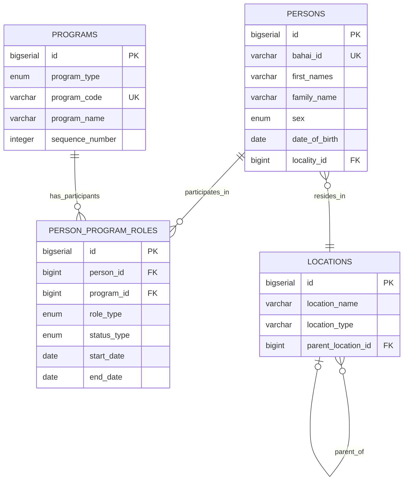

# Bahá'í Community Database Schema Documentation

## Executive Summary

This document describes the PostgreSQL database schema designed for the Bahá'í Community data, transformed from a denormalized Excel spreadsheet into a fully normalized relational database adhering to Third Normal Form (3NF). The schema supports efficient queries while maintaining data integrity and eliminating redundancy.

## Table of Contents

1. [Original Data Analysis](#original-data-analysis)
2. [Normalization Process](#normalization-process)
3. [Entity-Relationship Model](#entity-relationship-model)
4. [Table Descriptions](#table-descriptions)
5. [Key Design Decisions](#key-design-decisions)
6. [Query Examples](#query-examples)
7. [Migration Strategy](#migration-strategy)

## Original Data Analysis

### Source Data Structure
The original Excel file (`winnowed.xlsx`) contained:
- **507 columns** representing a highly denormalized structure
- Person information mixed with location hierarchies
- Repeated columns for program participation (current/previous, teaching/participating)
- Multiple columns for the same type of data (e.g., G1-G6 for children's classes)

### Identified Data Categories
1. **Personal Information**: Names, contact details, registration status
2. **Geographic Hierarchy**: 9-level location structure from neighborhood to national
3. **Educational Programs**:
   - Children's Classes (Grades 1-6)
   - Junior Youth Groups (15 different programs)
   - Study Circles (Books 1-14 with units)
4. **Participation Records**: Current/previous involvement as teacher or participant

## Normalization Process

### First Normal Form (1NF) - Achieving Atomicity

**Problem**: Original data had multiple values in single columns (e.g., multiple program participations as separate columns)

**Solution**:
- Created separate `programs` table with one row per program
- Created `person_program_roles` junction table for many-to-many relationships
- Ensured all attributes are atomic (single-valued)

### Second Normal Form (2NF) - Eliminating Partial Dependencies

**Problem**: In the original structure, program details would be repeated for each person-program combination

**Solution**:
- Separated program information into independent `programs` table
- Program attributes (name, type, sequence) depend only on program_id
- Person attributes depend only on person_id

### Third Normal Form (3NF) - Eliminating Transitive Dependencies

**Problem**: Location hierarchy created transitive dependencies:
- Person → Locality → Electoral Unit → Cluster → ... → National Community

**Solution**:
- Created self-referencing `locations` table
- Each location references only its immediate parent
- Persons reference only their immediate locality
- Hierarchy traversal handled through recursive CTEs in views

## Entity-Relationship Model



## Table Descriptions

### 1. `persons` Table
**Purpose**: Stores individual person records

**Key Attributes**:
- Personal identifiers (name, Bahá'í ID)
- Demographics (sex, age, date of birth)
- Contact information (address, phone, email)
- Administrative flags (devotional host, archived status)
- Single location reference (locality_id)

**Normalization Achievement**: No non-key attributes depend on other non-key attributes

### 2. `locations` Table
**Purpose**: Maintains geographic hierarchy using self-referencing pattern

**Key Attributes**:
- Unique location identifier
- Location name and type
- Parent location reference (self-join)

**Design Pattern**: Adjacency list model for hierarchical data

### 3. `programs` Table
**Purpose**: Catalog of all educational programs

**Key Attributes**:
- Program type (children's class, junior youth, study circle)
- Unique program code
- Descriptive name
- Sequence number for ordering

**Normalization Benefit**: Eliminates 464+ columns from original structure

### 4. `person_program_roles` Table
**Purpose**: Junction table for many-to-many relationships

**Key Attributes**:
- Foreign keys to persons and programs
- Role type (teacher/participant)
- Status type (current/previous)
- Date range tracking

**Design Features**:
- Composite unique constraint prevents duplicates
- Check constraints ensure data integrity
- Supports temporal queries

## Key Design Decisions

### 1. Primary Key Strategy
**Decision**: Use `BIGSERIAL` instead of UUID

**Rationale**:
- Single-node deployment (not distributed)
- Better performance for joins
- Simpler for data migration
- Natural ordering for audit purposes

### 2. Location Hierarchy Model
**Decision**: Self-referencing table with recursive CTEs

**Alternatives Considered**:
- Separate tables per level (rejected: inflexible)
- Nested sets (rejected: complex updates)
- Materialized paths (rejected: denormalization)

**Benefits**:
- Flexible hierarchy depth
- Efficient parent-child queries
- Easy to maintain

### 3. Program Participation Modeling
**Decision**: Single junction table with role and status types

**Alternatives Considered**:
- Separate tables for teaching vs. participating
- Separate tables for current vs. previous

**Benefits**:
- Reduced table count
- Unified querying
- Temporal tracking capability

### 4. Enum Types vs. Check Constraints
**Decision**: Use PostgreSQL enum types for fixed value sets

**Benefits**:
- Type safety
- Self-documenting
- Performance optimization
- Cannot be accidentally violated

## Query Examples

### 1. Find All Current Teachers of Children's Classes
```sql
SELECT
    p.first_names || ' ' || p.family_name AS full_name,
    pr.program_name,
    l.location_name
FROM person_program_roles ppr
JOIN persons p ON ppr.person_id = p.id
JOIN programs pr ON ppr.program_id = pr.id
JOIN locations l ON p.locality_id = l.id
WHERE ppr.role_type = 'teacher'
  AND ppr.status_type = 'current'
  AND pr.program_type = 'childrens_class'
ORDER BY l.location_name, pr.sequence_number;
```

### 2. Get Complete Location Hierarchy for a Person
```sql
WITH RECURSIVE location_path AS (
    SELECT id, location_name, location_type, parent_location_id,
           location_name::TEXT as path
    FROM locations
    WHERE id = (SELECT locality_id FROM persons WHERE bahai_id = '13046')

    UNION ALL

    SELECT l.id, l.location_name, l.location_type, l.parent_location_id,
           l.location_name || ' > ' || lp.path
    FROM locations l
    JOIN location_path lp ON l.id = lp.parent_location_id
)
SELECT path FROM location_path
WHERE parent_location_id IS NULL;
```

### 3. Program Participation Summary
```sql
SELECT
    pr.program_type,
    COUNT(DISTINCT CASE WHEN ppr.role_type = 'teacher'
           THEN ppr.person_id END) as teachers,
    COUNT(DISTINCT CASE WHEN ppr.role_type = 'participant'
           THEN ppr.person_id END) as participants
FROM programs pr
LEFT JOIN person_program_roles ppr ON pr.id = ppr.program_id
WHERE ppr.status_type = 'current'
GROUP BY pr.program_type;
```

## Migration Strategy

### Phase 1: Schema Creation
```bash
psql -U postgres -d your_database -f bahai_community_schema.sql
```

### Phase 2: Location Hierarchy Import
1. Extract unique location combinations from Excel
2. Build hierarchy from national level down
3. Insert using recursive approach to maintain referential integrity

### Phase 3: Person Data Import
```python
# Python pseudocode for migration
import csv
import psycopg2

def migrate_persons(csv_file, connection):
    cursor = connection.cursor()
    with open(csv_file, 'r') as f:
        reader = csv.DictReader(f)
        for row in reader:
            # Insert person
            cursor.execute("""
                INSERT INTO persons (
                    bahai_id, first_names, family_name,
                    sex, date_of_birth, email
                ) VALUES (%s, %s, %s, %s, %s, %s)
                RETURNING id
            """, (row['Bahá\'í ID'], row['First Name(s)'],
                  row['Family Name'], row['Sex'],
                  row['Date of Birth'], row['Email']))

            person_id = cursor.fetchone()[0]

            # Process program relationships
            process_program_relationships(row, person_id, cursor)
```

### Phase 4: Program Relationships
For each person, iterate through program-related columns and create appropriate entries in `person_program_roles` table using the provided `migrate_person_program_relationship` function.

## Performance Considerations

### Indexing Strategy
- **Primary Keys**: Automatic B-tree indexes
- **Foreign Keys**: Indexed for join performance
- **Search Fields**: Indexed email, names, Bahá'í ID
- **Filtering**: Indexed archived status, role types, status types

### View Performance
- Materialized views can be created for frequently accessed hierarchical data
- Consider partitioning `person_program_roles` by status_type if data grows large

### Query Optimization
- Use EXISTS instead of COUNT for existence checks
- Leverage covering indexes for read-heavy queries
- Monitor and analyze slow queries with `EXPLAIN ANALYZE`

## Data Integrity Rules

### Business Rules Enforced
1. **Registration Consistency**: If registered, must have registration date
2. **Archive Consistency**: If archived, must have archive date
3. **Date Logic**: End dates must be after start dates
4. **Status-Date Alignment**: Current status requires null end date
5. **Age Validation**: Age between 0-150 years
6. **Unique Participation**: One person cannot have duplicate current roles for same program

### Referential Integrity
- Cascade deletes from persons to their program roles
- Restricted deletes for locations with children
- Protected program deletions with existing participants

## Maintenance and Evolution

### Adding New Program Types
1. Update `program_type` enum (requires ALTER TYPE)
2. Insert new programs into `programs` table
3. Existing structure handles relationships automatically

### Adding Person Attributes
1. ALTER TABLE persons ADD COLUMN
2. Update relevant views
3. Modify import scripts

### Performance Monitoring
```sql
-- Monitor table sizes
SELECT
    schemaname,
    tablename,
    pg_size_pretty(pg_total_relation_size(schemaname||'.'||tablename)) AS size
FROM pg_tables
WHERE schemaname = 'bahai_community'
ORDER BY pg_total_relation_size(schemaname||'.'||tablename) DESC;

-- Check index usage
SELECT
    schemaname,
    tablename,
    indexname,
    idx_scan,
    idx_tup_read,
    idx_tup_fetch
FROM pg_stat_user_indexes
WHERE schemaname = 'bahai_community'
ORDER BY idx_scan DESC;
```

## Conclusion

This schema successfully transforms a 507-column denormalized spreadsheet into a clean, maintainable relational database that:

1. **Achieves 3NF**: Eliminates all redundancy and dependency issues
2. **Maintains Relationships**: Preserves all original data relationships
3. **Enables Complex Queries**: Supports hierarchical and temporal queries
4. **Ensures Data Integrity**: Enforces business rules through constraints
5. **Provides Scalability**: Can grow without schema changes
6. **Facilitates Maintenance**: Clear structure for updates and extensions

The design balances theoretical normalization principles with practical performance considerations, creating a robust foundation for the Bahá'í Community database system.